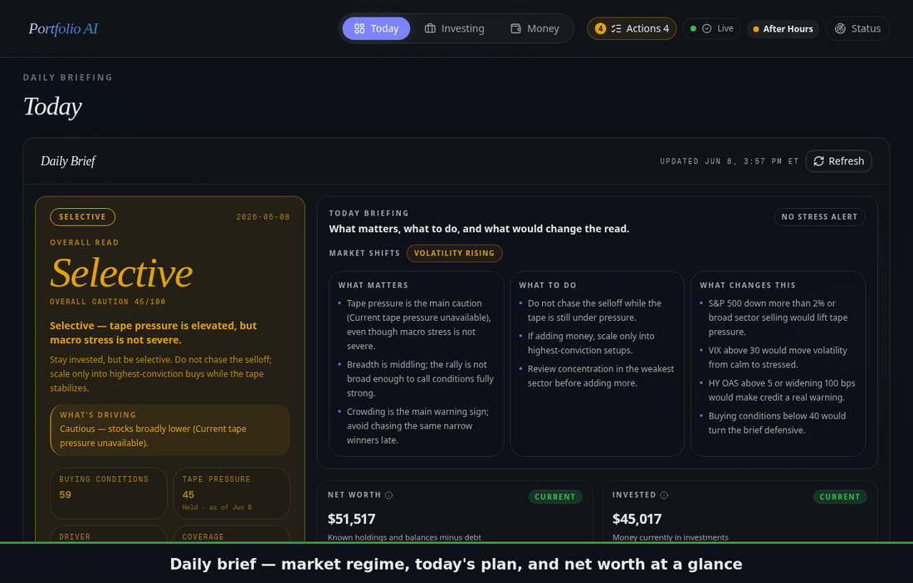

# Portfolio AI

[](https://github.com/elias-leslie/portfolio-ai/actions/workflows/ci.yml)
[](LICENSE)
[](https://www.python.org/)
[](https://fastapi.tiangolo.com/)
[](https://nextjs.org/)

Portfolio AI is a full-stack investment intelligence workspace for portfolio tracking, watchlists, market-data health, strategy research, and AI-assisted investment review. It combines a FastAPI backend, a Next.js frontend, PostgreSQL, Redis, Hatchet workflows, and optional external data/AI integrations.

> Portfolio AI is software for analysis and research. It is not financial advice, and it should not be used as the sole basis for investment decisions.



## What it does

- Tracks portfolios, accounts, positions, tax lots, snapshots, and allocation drift.
- Scores watchlist symbols with market data, news, technicals, fundamentals, and plain-language narratives.
- Runs macro and symbol workflows for market-readiness, scanner fan-out, strategy research, and data freshness.
- Provides household money, document-intake, budgeting, and retirement-planning surfaces when users choose to configure those integrations.
- Offers an optional Agent Hub companion path for AI chat, thesis validation, document review, and investment committee workflows.

## How it compares

Self-hosted finance tools split into three camps — trackers, budgeters, and
research terminals. Portfolio AI is the only one that spans all three *and* layers
AI-scored research on top: it scores each watchlist symbol from market data, news,
technicals, and fundamentals into a **plain-language narrative**, and (with the
optional Agent Hub companion) runs thesis validation and an **AI investment-committee**
review.

| | Portfolio AI | Ghostfolio · Wealthfolio | Maybe · Investbrain | OpenBB |
|---|:---:|:---:|:---:|:---:|
| Portfolio + tax-lot + drift tracking | ✅ | ✅ | ✅ | partial |
| AI-scored watchlist with narratives | ✅ | — | — | bring-your-own copilot |
| Household budgeting + retirement | ✅ | — | Maybe only | — |
| AI thesis validation / investment-committee | ✅ | — | chatbot only | — |
| Self-hosted, no SaaS required | ✅ | ✅ | ✅ | ✅ |

Trackers like Ghostfolio stop at performance math; Maybe and Investbrain bolt on a
chatbot; OpenBB has the research depth but no budgeting or household surfaces.
Portfolio AI brings scoring, narratives, budgeting, and committee review together.

> ⭐ If this is the finance workspace you've wanted, a star helps others find it.

## Stack

| Layer | Technology |
| --- | --- |
| Backend | Python 3.13, FastAPI, SQLAlchemy 2, Alembic, Pydantic 2 |
| Frontend | Next.js 16, React 19, TypeScript, Tailwind CSS 4 |
| Data | PostgreSQL 16, Redis, yfinance, RSS feeds, optional paid market-data APIs |
| Workflows | Hatchet |
| Quality | Ruff, ty, pytest, Biome, Vitest, TypeScript |
| Packaging | Docker Compose, uv, pnpm |

## Repository layout

```text
portfolio-ai/
├── backend/                 # FastAPI app, Alembic migrations, tests
├── frontend/                # Next.js app, React components, Vitest tests
├── docker/                  # Dockerfiles, bootstrap schema, local package wheel
├── scripts/                 # Public setup/check helper scripts
├── docker-compose.yml       # Standalone local stack
└── docker-compose.companion.yml # Optional Agent Hub companion override
```

## Requirements

For Docker installs:

- Docker Engine with the Compose plugin

For native installs:

- Python 3.13.x
- Node.js 20+
- `uv`
- `pnpm`
- Docker Engine with Compose plugin for PostgreSQL, Redis, and Hatchet

Python 3.14 is not currently supported because the technical-analysis dependency chain requires Python 3.13.

## Quickstart: Docker standalone

```bash
git clone https://github.com/elias-leslie/portfolio-ai.git
cd portfolio-ai
cp .env.example .env
./scripts/generate-hatchet-dev-token.sh .env
docker compose up -d --build
```

Then open <http://localhost:3000>.

Useful checks:

```bash
curl -fsS http://localhost:8000/health
curl -fsS http://localhost:3000 >/dev/null
docker compose logs --tail=100 portfolio-api portfolio-web portfolio-worker
```

For the bundled Docker stack, leave `PORTFOLIO_DB_URL` and `REDIS_URL` blank in `.env`; Compose injects container-internal service URLs.

## Native standalone

Use Docker for the backing services, then run the API, worker, and frontend locally:

```bash
cp .env.example .env.local
./scripts/generate-hatchet-dev-token.sh .env.local
docker compose --env-file .env.local up -d \
  portfolio-db portfolio-redis hatchet-migrate hatchet-setup-config hatchet

cd backend
uv sync --python 3.13 --frozen --extra dev
uv run alembic upgrade head
uv run uvicorn app.main:app --host 0.0.0.0 --port 8000
```

In a second shell:

```bash
cd backend
uv run python -m app.worker
```

In a third shell:

```bash
cd frontend
pnpm install --frozen-lockfile
pnpm build
API_URL=http://localhost:8000 HOSTNAME=0.0.0.0 PORT=3000 pnpm start
```

## Configuration

Copy `.env.example` to `.env` for Docker Compose or `.env.local` for native runs.

Required for the app stack:

- `PORTFOLIO_DB_URL`: required for native backend runs; leave blank for Docker Compose.
- `REDIS_URL`: required for native backend runs; leave blank for Docker Compose.
- `HATCHET_CLIENT_TOKEN`: generated by `scripts/generate-hatchet-dev-token.sh`.

Optional integrations:

- Market data: `POLYGON_API_KEY`, `TWELVEDATA_API_KEY`, `FMP_API_KEY`, `FINNHUB_API_KEY`, `ALPHAVANTAGE_API_KEY`, `FRED_API_KEY`, `SERPAPI_API_KEY`.
- Agent Hub companion: `AGENT_HUB_URL`, `PORTFOLIO_CLIENT_ID`, `PORTFOLIO_REQUEST_SOURCE`.
- Encrypted Plaid/SnapTrade credentials: set `PORTFOLIO_SECRET_KEY` before storing provider credentials.

When optional keys are absent, the app should still start. Features that need a missing provider show degraded or unavailable status instead of requiring secrets at boot.

## Optional Agent Hub companion mode

Agent Hub is not required for the standalone app. To enable companion AI/chat/review flows, start Agent Hub separately, set the companion variables in `.env`, and run:

```bash
docker compose -f docker-compose.yml -f docker-compose.companion.yml up -d --build
```

Use the same `PORTFOLIO_CLIENT_ID` on the Agent Hub side if you want first-party client registration to line up.

## Testing, linting, types, and build

Run the public helper:

```bash
./scripts/test-all.sh
```

Or run each gate manually:

```bash
cd backend
uv sync --python 3.13 --frozen --extra dev
uv run ruff check app tests
uv run ty check app
uv run pytest

cd ../frontend
pnpm install --frozen-lockfile
pnpm lint
pnpm exec tsc --noEmit
pnpm test -- --run
pnpm build
```

Docker build smoke:

```bash
cp .env.example .env
./scripts/generate-hatchet-dev-token.sh .env
docker compose up -d --build
curl -fsS http://localhost:8000/health
curl -fsS http://localhost:3000 >/dev/null
```

## MCP server

The backend package installs a read-only MCP server named `portfolio-ai-mcp`. It exposes the signal stack to MCP clients over stdio.

From `backend/`:

```bash
uv run portfolio-ai-mcp
```

For an MCP client, copy `.mcp.json.template` into the consuming project, update the `cwd` value to this repository's `backend/` directory, and make sure the backend environment variables point at a running database.

## API

Interactive API docs are available at <http://localhost:8000/docs> when the backend is running.

Common endpoint groups:

| Group | Endpoints | Purpose |
| --- | --- | --- |
| Health | `/health`, `/health/detailed` | Runtime and data-health status |
| Portfolio | `/api/portfolio/*` | Accounts, positions, analytics, IPS, TLH |
| Watchlist | `/api/watchlist/*` | Watchlist items, refreshes, narratives |
| Symbols | `/api/symbols/*` | Per-symbol intelligence and decision context |
| Market | `/api/market/*` | Market data, events, source status |
| Strategies | `/api/strategies/*` | Strategy definitions, signals, backtests |
| Household | `/api/household/*` | Optional household finance workspace |

## Security and privacy

- Keep real credentials in local environment files only; never commit `.env`, `.env.local`, provider tokens, exports, logs, screenshots with private data, or database dumps.
- Do not upload real account statements, brokerage data, or household finance documents to public demos.
- Report vulnerabilities through GitHub private vulnerability reporting. See `SECURITY.md`.

## License

Licensed under the Apache License, Version 2.0. See `LICENSE` and `NOTICE`.
